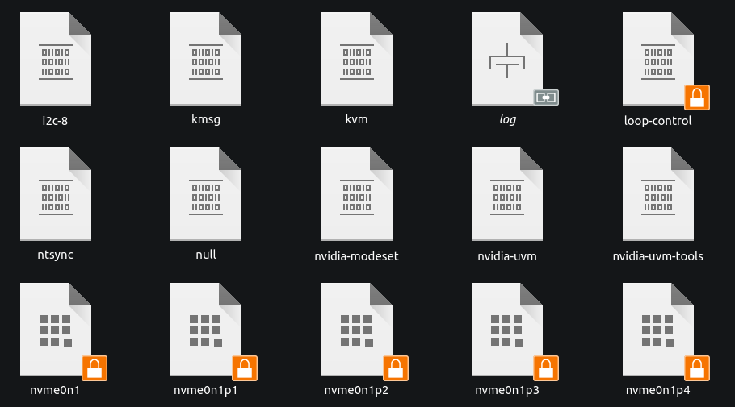
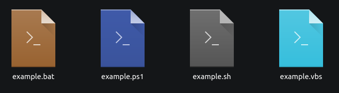

# Breeze Expanded
Extra icons for KDE's Breeze theme.

No icon theme can possibly have icons for every file type, but for some file types I do want to have pretty icons where Breeze does not provide them. This repository contains icons I created myself by hand. It includes a few icons for specific types, as well as some generic icons you can manually assign to types you want to identify more easily.

Currently, there are only mimetype icons.

Included icons, among others:
- A few inode types: `blockdevice`, `chardevice`, `fifo` (better known as a pipe) and `socket`.
- SystemD `.service` and `.timer` files
- Shell script, source code and plaintext icons in multiple colours
- Lock files
- and more...

## Installation
The easiest way to install the theme is to copy or symlink `breeze-expanded(-dark)` to `~/.local/share/icons/` (directory may not exist yet), and then select the theme from the KDE settings menu. The theme will automatically inherit from Breeze (Dark). You can add other Breeze expansion packs to the list to inherit from them first. Just add their directory name to the `Inherits` part of `index.theme`.

(Breeze Light is currently not included yet, though the only differences will be the colour for icon sizes 16 and 22 for a few icons).

You don't need the `source` directory to use the icons. The source directory contains icon files that include all four sizes in a single file. They need to be exported before they can be used. The exporter is also self-made, and is not (yet) released on Github.

## Preview
Quickly see differences in filetypes in `/dev/`. Most files are char devices, the bottom row is block devices, and there is one socket.

Differenciate different types of shell script (these do need to be manually assigned)

## Known issues
I recently tried my theme on Ubuntu 24.04LTS (with KDE frontend) with Plasma 5 and saw that it struggles with icons that use the 'currentColor' directive in SVG files... which is every icon I've made. If the icons look a lot more black than you'd expect, that's probably the reason. The fix is replacing every 'currentColor' with the colour code of the current colour, usually defined in the class.

The exporter has been updated to resolve currentColor values at build-time, so this issue should be solved. It has however not been tested yet.

## New icons
There's an ever-growing list of file types I want to create icons for. So I'll probably continue to update this repository... slowly. Though, if there's a specific file type you really want an icon for, you can always request it. No promises if and when I'll get to it though.
